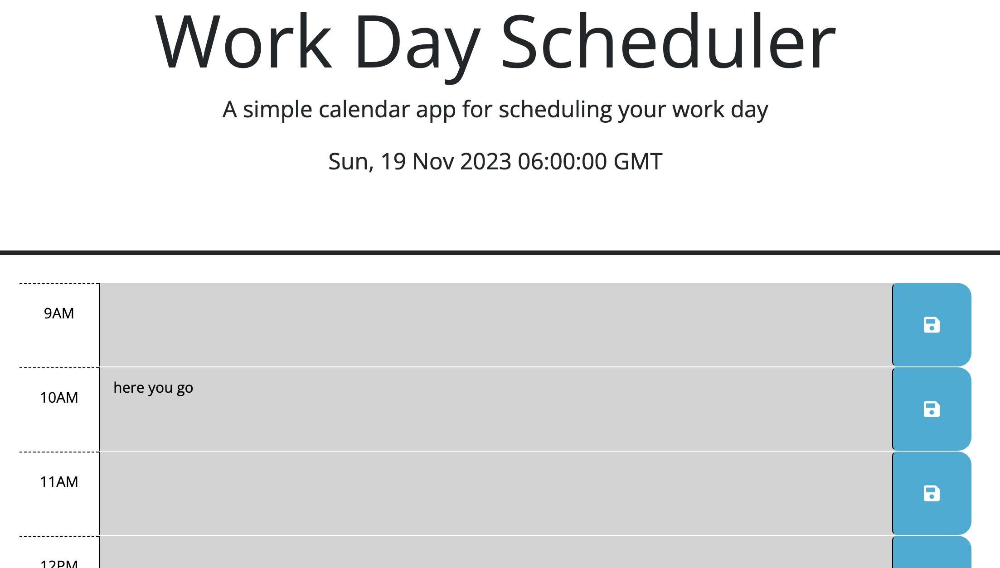

# Third-Party APIs: What To Do

## Goal
Create a calendar application that saves user-input tasks to time slots and color-codes time slots by hour. Limit the range of hours to a typical workday.

## Screenshot

## Page Deployed
[Deployed web scheduler]()
